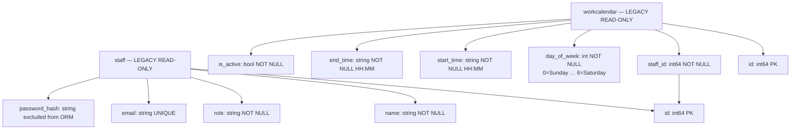

# work-schedule — Documentation Plan

> **Goal:** Create the complete standard documentation set so the module has a clear
> architecture reference, LLM-friendly skill summary, database diagrams, and a rich README
> that acts as an index.
>
> **No code changes.** This plan is documentation-only.

---

## Development Rules

- **Agent Setup:** Run `go install github.com/tinywasm/devflow/cmd/gotest@latest` before anything.
- **No external libraries.** Standard library + `tinywasm/*` polyfills only.
- **Build Tags:** All server-side files carry `//go:build !wasm`. Do not alter them.
- **Publishing:** Run `gopush 'docs: add architecture, skill and diagrams'`. Never `git commit/push` directly.
- **Diagram format:** Mermaid inside a `*.md` file stored in `docs/diagrams/`. Use `flowchart TD`. Never use `subgraph`.

---

## Context: What the module does

`work-schedule` provides a read-only view of the **weekly work calendar** for staff members.
It reads two **legacy tables** (`staff`, `workcalendar`) that are managed externally —
this module performs **no DDL** (no `db.CreateTable`).

**MCP Tools exposed (via `RegisterProvider`):**

| Tool | Parameters | Description |
|------|-----------|-------------|
| `get_work_schedule` | `staff_id` (number, required) | Returns the staff member's profile and weekly schedule. |

**Schema (legacy — READ-ONLY):**

`staff` table:

| Field | Type | Constraint |
|-------|------|------------|
| `id` | int64 | PK |
| `name` | string | NOT NULL |
| `role` | string | NOT NULL |
| `email` | string | UNIQUE |
| `password_hash` | string | excluded from ORM (`db:"-"`) |

`workcalendar` table:

| Field | Type | Constraint |
|-------|------|------------|
| `id` | int64 | PK |
| `staff_id` | int64 | FK → staff.id, NOT NULL |
| `day_of_week` | int | NOT NULL (0=Sunday … 6=Saturday) |
| `start_time` | string | NOT NULL ("HH:MM") |
| `end_time` | string | NOT NULL ("HH:MM") |
| `is_active` | bool | NOT NULL |

---

## Step 1 — Create `docs/ARCHITECTURE.md`

Create the file `docs/ARCHITECTURE.md` with the following content:

```markdown
# work-schedule Architecture

## 1. Domain Scope
Provides a read-only view of the weekly work schedule for clinic staff (doctors, nurses, etc.).
Reads from two legacy tables maintained by an external system.

## 2. Core Entities
- **Staff:** The clinic employee. `password_hash` is excluded from ORM output (`db:"-"`).
- **WorkCalendar:** One row per staff member per working day. `is_active = false` indicates
  a non-working day; `start_time`/`end_time` are meaningful only when `is_active = true`.

## 3. Architectural Patterns
1. **Read-Only / No DDL:** This module does NOT call `db.CreateTable()`. Tables are managed
   by the legacy system. `New(db)` is side-effect free apart from storing the DB reference.
2. **Dependency Injection:** `New(db *orm.DB)` returns `*Module`. No global state.
3. **MCP Self-Registration:** `*Module` implements `mcp.ToolProvider` via `GetMCPToolsMetadata()`.
   Registered via `RegisterTools(srv)`.
4. **Safe Conversion:** `staff_id` from MCP args is converted via `fmt.Convert(raw).Int64()`
   to safely handle both `float64` (JSON default) and `int64` inputs.

## 4. MCP Tools
| Tool | Parameters | Returns |
|------|-----------|---------|
| `get_work_schedule` | `staff_id` (number, required) | `staff_name`, `staff_role`, `schedule[]` (day, day_name, is_active, start, end) |

Spanish day names: Domingo, Lunes, Martes, Miércoles, Jueves, Viernes, Sábado.
`start`/`end` fields are omitted when `is_active = false`.

## 5. Schema
See [`docs/diagrams/database.md`](diagrams/database.md).
```

---

## Step 2 — Create `docs/diagrams/database.md`

Create the file `docs/diagrams/database.md`:

````markdown
# work-schedule — Database Diagram



> **No DDL allowed.** Tables are owned by the legacy system.
> Read strategy: first fetch `staff` by `staff_id`, then fetch all `workcalendar`
> rows for that staff ordered by `day_of_week ASC`.
````

---

## Step 3 — Create `docs/SKILL.md`

Create the file `docs/SKILL.md`:

```markdown
# work-schedule — LLM Skill Summary

## Purpose
Read-only adapter over legacy `staff` and `workcalendar` tables.
Exposes a single MCP tool (`get_work_schedule`) that returns a staff member's weekly schedule.

## Key Files
| File | Role |
|------|------|
| `model.go` | `Staff` + `WorkCalendar` structs, both `TableName()` methods |
| `model_orm.go` | Auto-generated ORM helpers — DO NOT EDIT |
| `mcp.go` | `Module`, `New(db)`, `GetMCPToolsMetadata()`, `RegisterTools()`, `GetWorkSchedule()`, `buildStaffResponse()` |
| `mcp_test.go` | All tests (`workschedule` package, `:memory:` SQLite) |

## Constraints
- **No DDL.** Never call `db.CreateTable()` for `staff` or `workcalendar`.
- `password_hash` has `db:"-"` — it is never read or written by ORM.
- `staff_id` from MCP args must be converted via `fmt.Convert(raw).Int64()` (handles float64 from JSON).
- `start`/`end` omitted from response when `is_active = false`.

## MCP Registration
```go
m := workschedule.New(db)
m.RegisterTools(srv) // srv is *mcp.MCPServer
```
```

---

## Step 4 — Update `README.md`

Replace the current minimal `README.md` with:

```markdown
# work-schedule
<!-- START_SECTION:BADGES_SECTION -->
<a href="docs/img/badges.svg"></a>
<!-- END_SECTION:BADGES_SECTION -->

Read-only MCP adapter for the weekly work schedule of clinic staff.
Reads from legacy `staff` and `workcalendar` tables — no DDL operations.

## MCP Tools

| Tool | Parameters | Description |
|------|-----------|-------------|
| `get_work_schedule` | `staff_id` (number) | Returns staff profile and weekly schedule. |

## Quick Start

```go
import workschedule "github.com/veltylabs/work-schedule"

m := workschedule.New(db)  // read-only: no table creation
m.RegisterTools(srv)       // registers MCP tools on *mcp.MCPServer
```

## Documentation

| Document | Description |
|----------|-------------|
| [ARCHITECTURE.md](docs/ARCHITECTURE.md) | Domain scope, patterns, and MCP tool reference |
| [Database Diagram](docs/diagrams/database.md) | Legacy schema diagram |
| [SKILL.md](docs/SKILL.md) | LLM-friendly condensed summary |
```

---

## Step 5 — Verify & Submit

```bash
gotest

gopush 'docs: add architecture, database diagram, skill summary and enrich README'
```
