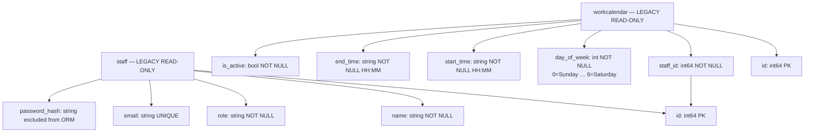

# work-schedule — Database Diagram

> **No DDL allowed.** Tables are owned by the legacy system.
> Read strategy: first fetch `staff` by `staff_id`, then fetch all `workcalendar`
> rows for that staff ordered by `day_of_week ASC`.
